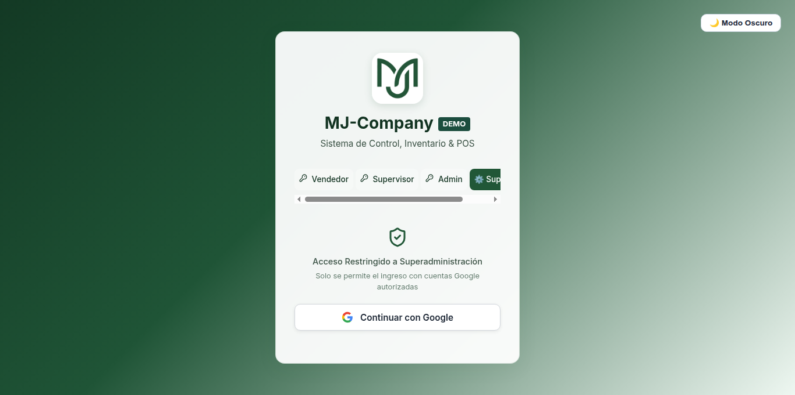

#  Manual Técnico & Gobierno: Rol Superadmin - MJ-Company

**Sistema de Control, Inventario & Punto de Venta (POS)**  
*Versión: 2.0 (MJ-Company)*

---

## 1. Introducción y Arquitectura de Acceso Seguro

El rol de **Superadmin** constituye el nivel máximo de privilegios del ecosistema tecnológico de **MJ-Company**. Cuenta con acceso irrestricto a la base de datos de Firestore, reglas de seguridad, auditorías globales de trazabilidad y configuración del sistema.

### Autenticación Exclusiva con Google (Zero Password / Biometría)
Por estrictas políticas de seguridad implementadas en **MJ-Company**, el acceso de Superadmin no admite contraseñas locales ni PINs. La verificación se realiza **ÚNICAMENTE** mediante **Google Sign-In** con lista blanca estricta en el servidor y reglas de Firestore.



### Cuentas Autorizadas Exclusivas:
1. `esaalberdi@gmail.com`
2. `lemaitremariejoe@gmail.com`

> [!NOTE]
> Cualquier intento de autenticación con una cuenta Google no registrada en la lista blanca será revocado de inmediato por el proveedor de autenticación y bloqueado por las reglas de Firestore.

---

## 2. Panel de Superadministración Global


### Capacidades Exclusivas:

### A. Auditoría Global del Sistema y Logs de Seguridad
* Registro inmutable de todos los eventos críticos:
  * Inicios de sesión y aperturas de turnos.
  * Modificaciones directas en inventarios y precios.
  * Anulaciones de ventas y autorizaciones de mermas.
  * Cambios de roles y asignación de PINs.

### B. Respaldo y Exportación de la Base de Datos
* Descarga completa de colecciones críticas (`products`, `sales`, `shifts`, `deposits`, `users`) en formatos JSON / CSV para copias de seguridad externas.

### C. Restablecimiento y Sincronización de Base de Datos
* Capacidad de ejecutar scripts administrativos para reseteo controlado de inventarios, migración de catálogos y reajuste masivo de stock.

### D. Gobernanza de Firestore y Reglas de Seguridad
* Las reglas de seguridad en [`firestore.rules`](file:///home/andres-alberdi/.gemini/antigravity/scratch/DemoMJ/firestore.rules) garantizan a nivel de kernel de Google Cloud que únicamente los tokens de `esaalberdi@gmail.com` y `lemaitremariejoe@gmail.com` posean permisos de mutación sobre roles y colecciones críticas:

```javascript
function isSuperAdmin() {
  return isAuthenticated() && (
    request.auth.token.email == 'esaalberdi@gmail.com' ||
    request.auth.token.email == 'lemaitremariejoe@gmail.com' ||
    get(/databases/$(database)/documents/users/$(request.auth.uid)).data.role == 'superadmin'
  );
}
```

---

## 3. Resumen de Credenciales de Prueba Iniciales

Para fines de demostración y capacitación del personal, se encuentran aprovisionados los siguientes usuarios iniciales en la base de datos:

| Rol | Método de Acceso | Identificador / Correo | Contraseña / PIN | Nombre Asignado |
| :--- | :--- | :--- | :--- | :--- |
| **Vendedor** | PIN numérico (6 dígitos) | `111111` | *(Solo PIN)* | Vendedor Mostrador |
| **Supervisor** | Correo Corporativo | `supervisor@mjcompany.io` | `Supervisor*123` | Supervisor Turno |
| **Admin** | Correo Corporativo | `admin@mjcompany.io` | `Admin*123` | Administrador Local |
| **Superadmin** | **Botón de Google** | `esaalberdi@gmail.com` | *(Autenticación Google)* | Superadmin E.S.A. |
| **Superadmin** | **Botón de Google** | `lemaitremariejoe@gmail.com` | *(Autenticación Google)* | Superadmin Marie-Joe |

---

## 4. Asistente RAG con IA Generativa
El sistema cuenta con un **Asistente Inteligente MJ** accesible permanentemente en la esquina inferior derecha. Dispone de un motor RAG con IA generativa (Gemini + respaldo local) con **aislamiento jerárquico estricto**: cada rol solo puede consultar información de su propio nivel o inferiores, protegiendo las funciones de mayor jerarquía.
