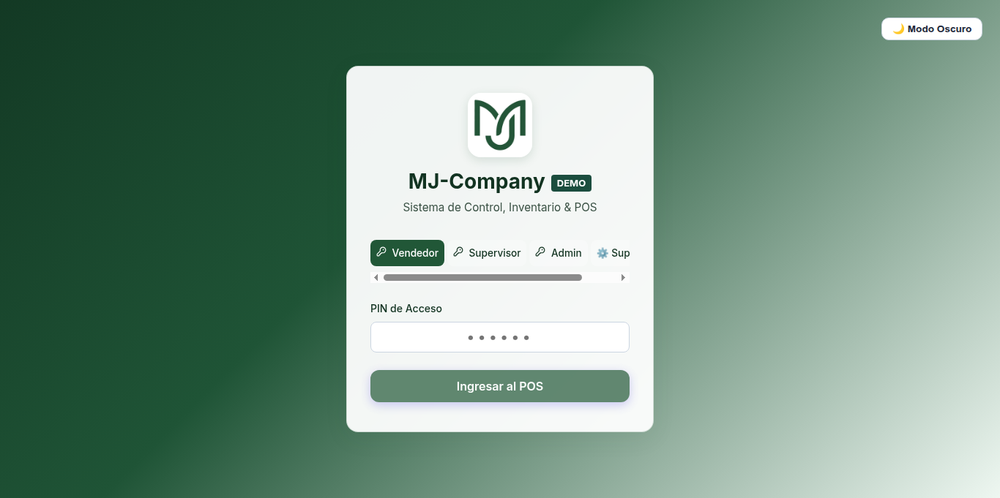

#  Manual Operativo: Rol Vendedor - MJ-Company

**Sistema de Control, Inventario & Punto de Venta (POS)**  
*Versión: 2.0 (MJ-Company)*

---

## 1. Introducción y Acceso al Sistema

El rol de **Vendedor** está diseñado para agilizar la operación diaria de caja, cobro y despacho de productos en los puntos de venta de **MJ-Company**. El acceso se realiza mediante un **PIN de 6 dígitos** único asignado por la administración.

### Pantalla de Inicio de Sesión

### Pasos para Ingresar:
1. En la pestaña **Vendedor**, ingresa tu PIN personal de 6 dígitos (por ejemplo: `111111`).
2. El sistema validará automáticamente las credenciales y te dirigirá a la **Terminal de Ventas (POS)**.
3. Puedes alternar entre **Modo Claro** y **Modo Oscuro** utilizando el botón en la esquina superior derecha.

---

## 2. Terminal de Ventas (POS)

Una vez autenticado, se presenta la interfaz interactiva de ventas con el catálogo completo de productos de **MJ-Company**.

### Elementos de la Pantalla:
* **Cabecera**: Muestra el nombre del operador activo, el estado del turno actual y el botón para alternar vistas o cerrar sesión.
* **Filtros por Categoría**: Botones superiores para filtrar rápidamente productos (Bebidas, Snacks, Golosinas, etc.).
* **Buscador Dinámico**: Barra de búsqueda en tiempo real por nombre de producto.
* **Catálogo de Productos**: Tarjetas con nombre, categoría, precio unitario en Bs y stock disponible. Al hacer clic en un producto se añade automáticamente al carrito.
* **Carrito de Compras**: Panel lateral que consolida los ítems seleccionados, cantidades (+ / -), subtotal y cálculo automático del total a pagar.

---

## 3. Modalidades de Cobro

MJ-Company soporta cuatro modalidades de cobro:

### A. Pago en Efectivo
1. Con los productos en el carrito, selecciona **Efectivo**.
2. Ingresa el monto recibido del cliente.
3. El sistema calcula y muestra en pantalla el **Cambio / Cambio a devolver**.
4. Haz clic en **Confirmar Venta**. Se descuenta el stock inmediatamente y se registra la venta en el turno abierto.

### B. Pago por QR (Transferencia Bancaria)
1. Selecciona la opción **QR**.
2. El cliente escanea el código QR oficial de la cuenta bancaria de **MJ-Company**.
3. Confirma la recepción del comprobante bancario antes de finalizar la transacción.
4. Presiona **Confirmar Venta QR**.

### C. Pago Mixto (Efectivo + QR)
* Permite dividir el total de la cuenta entre una parte en efectivo y otra parte en QR.
* Ejemplo: Cuenta de 50 Bs -> 20 Bs en Efectivo y 30 Bs en QR.
* Ambos montos se imputan con exactitud en las métricas del arqueo de caja.

### D. Préstamos / Fianza Interna
* En caso de consumos autorizados a crédito o préstamo a personal/clientes recurrentes, se puede registrar como venta en préstamo indicando el nombre del deudor.

---

## 4. Gestión del Turno y Cierre de Caja

1. **Apertura de Turno**: Al iniciar la jornada, el sistema solicita ingresar el monto de **Efectivo Inicial en Caja**.
2. **Registro de Ingresos Extra**: Permite ingresar entradas menores justificadas.
3. **Cierre de Turno**: Al finalizar la jornada, se genera el resumen de ventas en efectivo, QR y préstamos para conciliar con el conteo físico antes del cambio de guardia.

---

## 5. Buenas Prácticas y Soporte
* Nunca compartas tu PIN de 6 dígitos con otros operadores.
* En caso de diferencias en stock físico vs sistema, notifica de inmediato a tu **Supervisor**.
* Verifica siempre el comprobante de transferencia cuando cobres por QR.
